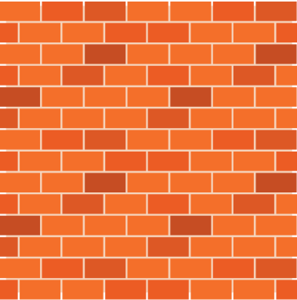
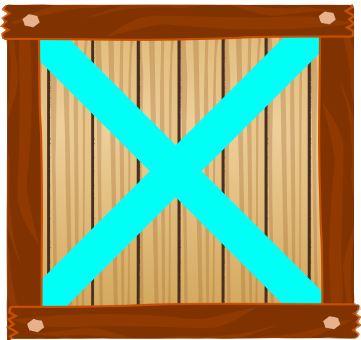

# Sokoban Game
## Giới thiệu
Chào mừng đến với Sokoban! Đây là một trò chơi puzzle kinh điển, nơi mục tiêu của người chơi là đẩy các hộp vào vị trí được chỉ định. Nhiệm vụ của bạn là giải quyết các cấp độ khác nhau bằng cách di chuyển nhân vật và các hộp một cách chiến lược.
## Cài đặt
Để chơi Sokoban, làm theo các bước sau: <br>

1.Sao chép kho lưu trữ:

Copy code  ``` git clone https://github.com/22021202-VU-VAN-HUY/Sokoban.git ```

Ngoài ra, bạn có thể tải xuống kho lưu trữ dưới dạng tệp ZIP và giải nén vào vị trí mong muốn.

2. Mở thư mục **Sokoban**.

4. Mở file **sokoban.cbp**

6. Nếu bạn dùng **codeblock** nhấn **F9** để biên dịch và chạy trò chơi.

Bây giờ bạn đã sẵn sàng chơi Sokoban!

## Cách chơi
- Mục tiêu của trò chơi là đẩy tất cả các hộp vào vị trí đích. 

- Nhân vật có thể di chuyển lên, xuống, trái và phải, nhưng chỉ có thể đẩy một hộp một lúc. 

- Người chơi cần lên kế hoạch di chuyển một cách chiến lược để tránh bị kẹt hoặc làm kẹt các hộp.

- Hãy sắp xếp nước đi của bạn một cách thông minh và tận dụng sự suy nghĩ chiến lược để giải quyết các câu đố trong Sokoban.

## Hình ảnh trong game

| Các đối tượng trong game |  hình ảnh | 
| :----------------------- | :-------- | 
| Nhân vật trong trò chơi  |        |      
| Bức tường                |              |
| Vị trí đích              |  | 
| Hộp thường               |               | 
| Hộp ở vị trí đích        |       | 


## Tổ hợp phím
Dưới đây là các tổ hợp phím để điều khiển nhân vật trong trò chơi:

- Phím mũi tên lên &uarr; : Di chuyển lên

- Phím mũi tên xuống &darr; : Di chuyển xuống

- Phím mũi tên trái &larr; : Di chuyển sang trái

- Phím mũi tên phải &rarr; : Di chuyển sang phải


**Chúc may mắn và hãy thưởng thức trò chơi Sokoban!**

